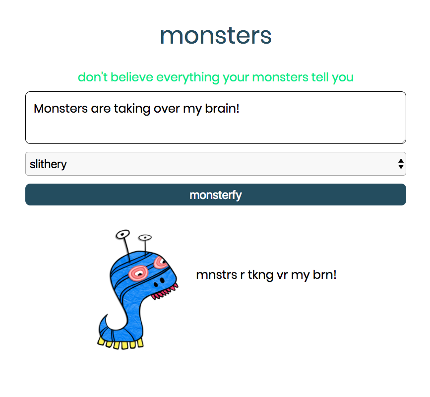

## Monsters - frontend

Frontend built with HMTL, CSS, JavaScript, and Flexbox, deployed on Firebase. [Visit the site](https://monstersofmine.firebaseapp.com/)

The Monsters app takes in a negative thought or fear and gives it a personality. When your monster says your thought back to you, it's easy to see that monsters can't always be trusted.

[View the backend code](https://github.com/amberjohnsonsmile/monsters-backend)

[Visit the site](https://monstersofmine.firebaseapp.com/)
