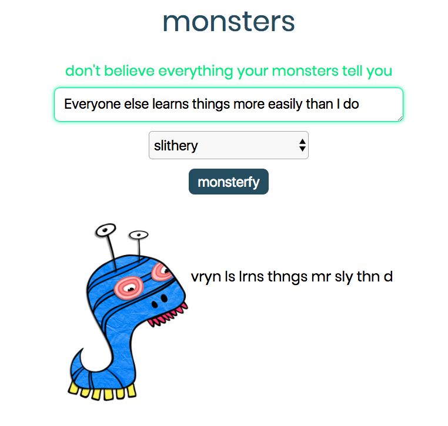

## Monsters

The Monsters app takes in a negative thought or fear and gives it a personality. When your monster says your thought back to you, it's easy to see that monsters can't always be trusted.

#### Galvanize Web App

Frontend for "Galvanize Web App" project: https://github.com/amberjohnsonsmile/galvanize-web-app

For this project, you will build a light application that reads and writes data, has unit tests for functions, and integrates with an API. The topic is up to you, so pick a project that speaks to your interests.

#### Front-end

Build a client that reads and writes data from your API.

* You should have a brochure page that has information about what your app does and who it's for.
* You should have a form that writes data to your API
* You should read some data from your API that is dynamically added to the page
* Deploy your front-end
